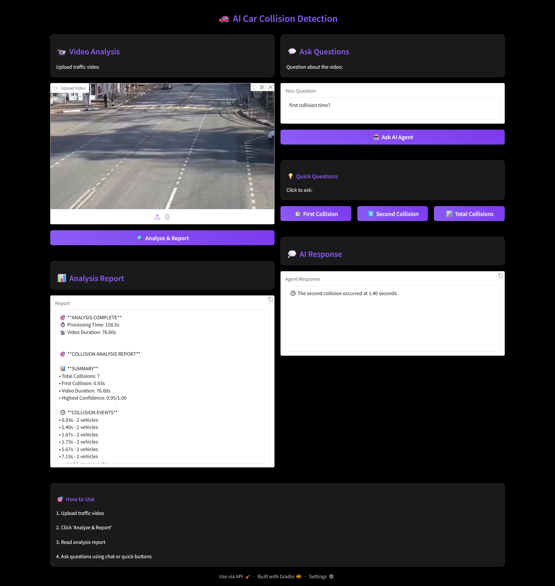

# Computer Vision Projects

This repository contains multiple CV projects and demos:

- `accident-detection/` — Car collision detection using YOLOv8 + agentic analysis (Gradio UI).

## Demo Screenshot

- `finger-count-voice/` — Finger counting with voice using mediapipe.
- `human-detect-email/` — Human detection with email alert using smtplib and medipipe.
